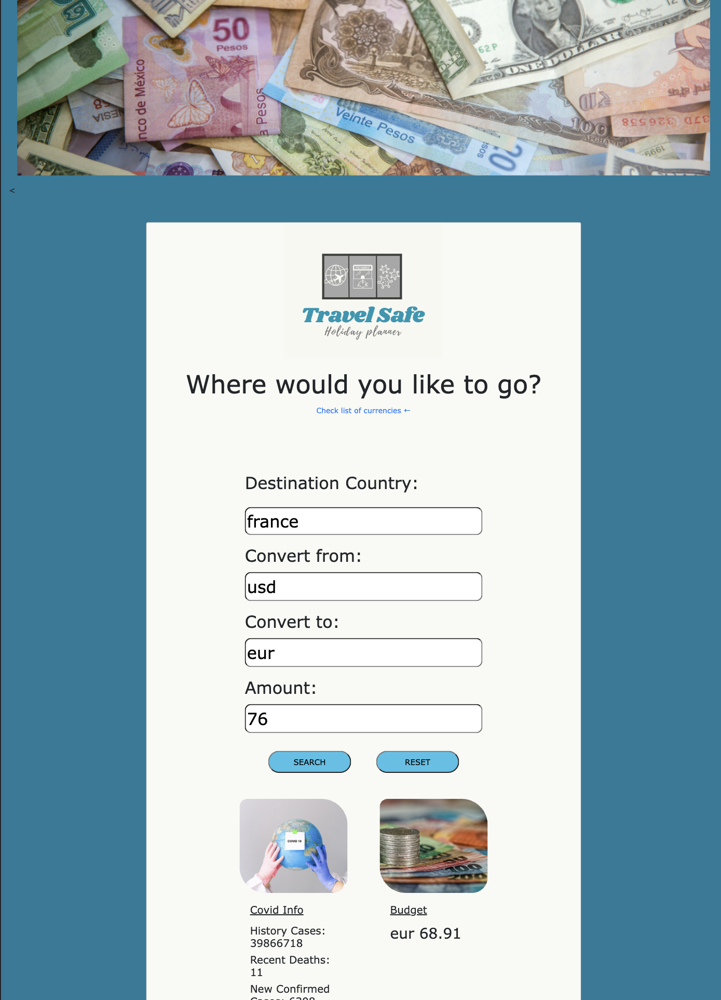

# Project-1-HolidayApp
Bootcamp: UBHM_Module 9 Project 1

AS an organised person who also enjoy to travel,
I WANT to know in advance the  COVID situation of possible countries that I would like to visit, and also , the exchange rate
SO THAT I can have a better plan according to my budget, and health concerns.

We created an app which provides the data for Currency rates, and number of active COVID cases, using two different APIs.

The user log into the website, and provide the details on the input fields (destination country, currency type and budget).

Installation
This application run in the browser, so no installation needed.

# Usage
1. Destination Country: Add the country you would like to visit on this field.
2. FROM: Type the currency which you use here
3. TO: Here, add que local currency of the place that you would like to visit.
    (If you don't know the currency codes, you can click on the link above to see all the available codes)
4. Amount: Enter the amount of money you are planning to spend during your stay.
5. Click "SEARCH" to get the latest information related to COVID, and the exchange rate.
6. Would you like to look somewhere else? Click "RESET" and start again.

# Credits
- Exchange Rate API: https://rapidapi.com/apininjas/api/currency-converter-by-api-ninjas/
- COVID API: "https://api.covid19api.com/summary" & Documentation: https://api-sports.io/documentation/covid-19/v1

- Images: https://www.pexels.com/ & https://unsplash.com/

- Daniel Kopacz: https://github.com/Daaanxx/
- Fatma Keskin: https://github.com/milkibeka
- Karla Fuentes Guerrero: https://github.com/KarlaFuGue

# Links
- Repo: https://github.com/Daaanxx/Project-1-HolidayApp.git
- Deployed page: https://daaanxx.github.io/Project-1-HolidayApp/

# Languages & Sources
- HTML
- CSS
- JS
- Bootstrap
- Canva
- Jquery
- APIs
- Figma
- Postman 
- YouTube